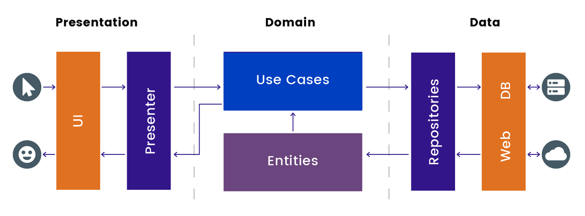
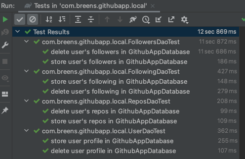
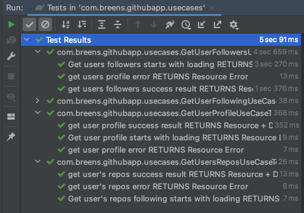
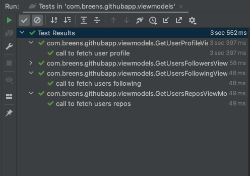
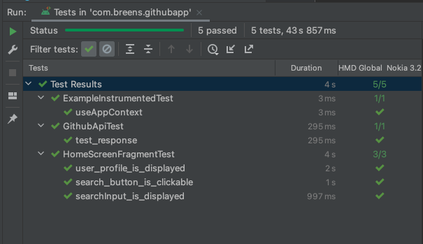
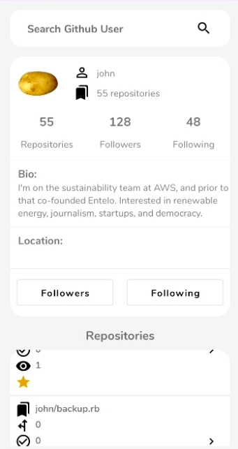
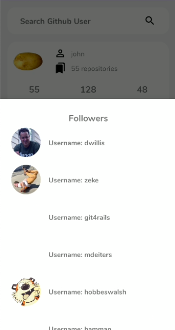
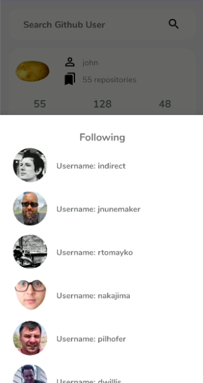

## Github App

An android app built using Kotlin that consumes the Github API to search for Github profiles and more information on the user. It has been built following Clean Architecture Principles, MVVM Architecture/Pattern and Modern Jetpack components.

## Architecture (Clean Architecture).
Clean Architecture combines a group of practices that produce systems with the following characteristics:
- Testable.
- UI-independent (the UI can easily be changed without changing the system).
- Independent of databases, frameworks, external agencies, and libraries.

The following scheme presents the architecture from the UI to the backend or database:

As you can see in the image, an Android application with Clean Architecture gathers the layers into three modules:
1. Presentation - presents data to a screen and handle user interactions.
    - Components:
        - Activities/ Fragments
        - ViewModels

2. Domain - which contains business logic
    - Components:
        - Models (Entities)
        - UseCases
        - Repositories Implementation

3. Data - which manages application data eg. retrieve data from the network, manage data cache.
    - Components:
        - Local data sources
        - Remote data sources
        - Repositories Interfaces

## Testing 

### Local Database
To test the deletion, insertion and getting of user profile and repository
- 

### UseCases
To test the domain's use-cases and repositories and if they make the right call
- 

### ViewModels
To test the logic of the app
- 

### Github API and Fragments
This integration test was done under an Android 11 version device
Did some integration tests to test the Github API is called successfully
Did some integration test to test if the search input layout is shown and the recyclerview holding the list of repositories is shown. Also if the search button is is clickable
- 

### ScreenShots
&emsp;

